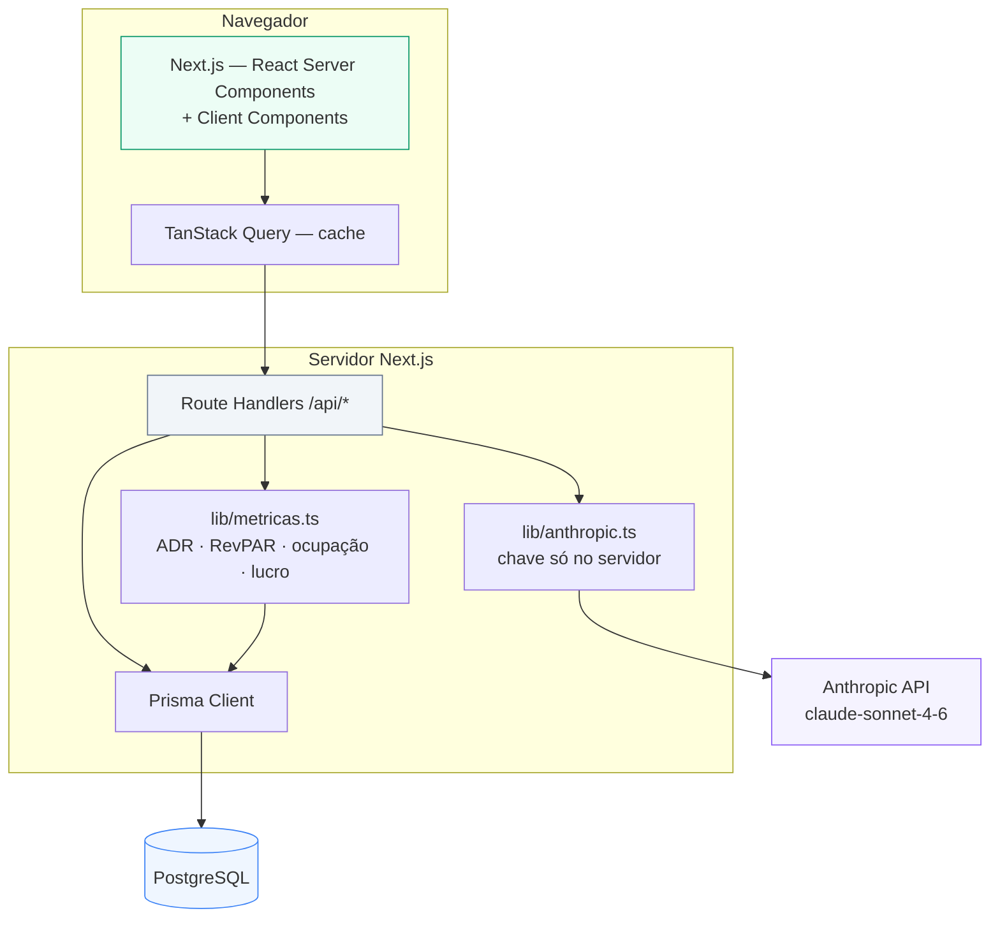
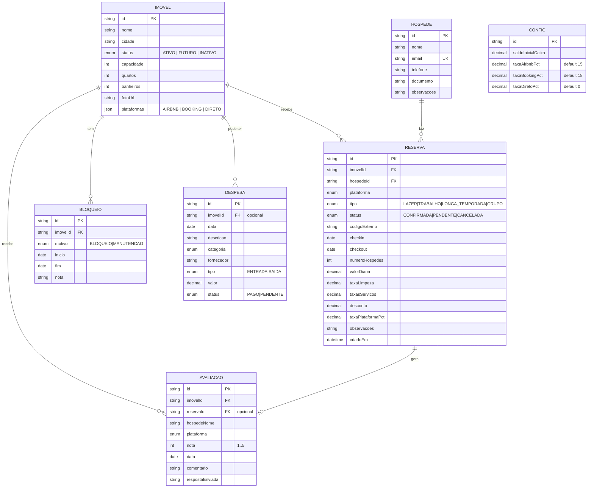
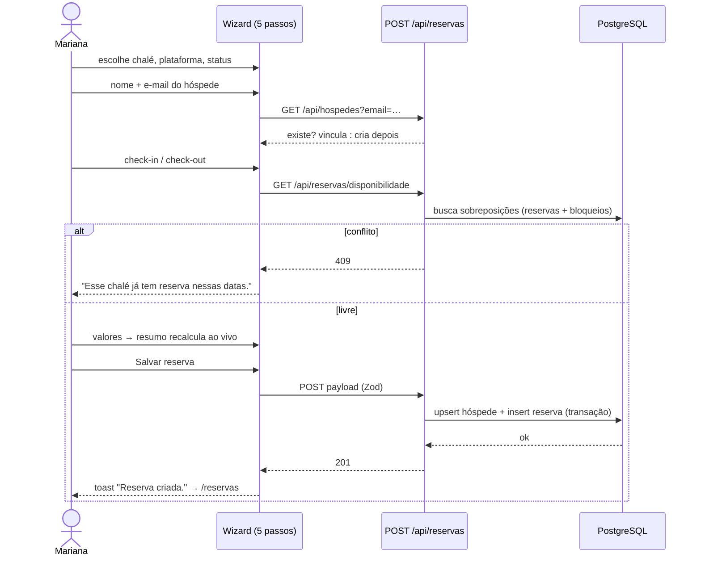
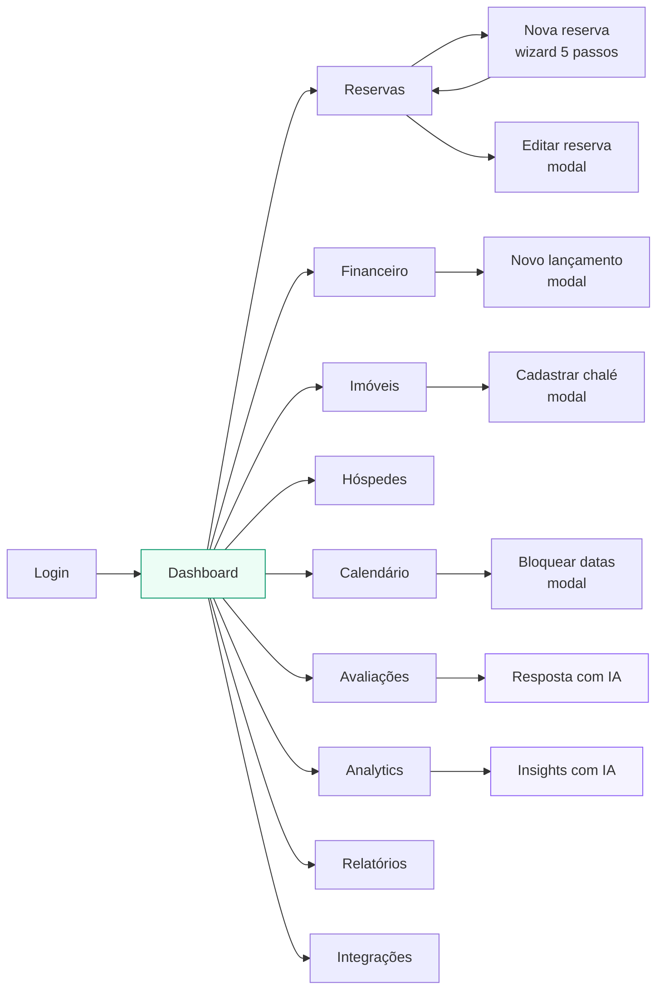

# PRD — Morada nas Nuvens
### Sistema de gestão de pousada (PMS) — v1.0

**Cliente:** Pousada Morada nas Nuvens — Visconde de Mauá, RJ
**Usuária:** Mariana Ferraz (proprietária) — usuária única no v1
**Objetivo do v1:** substituir a planilha. Lançamento **100% manual** de reservas, despesas e avaliações, com painéis de desempenho e um assistente de IA que lê os dados e sugere ações.
**Fora do escopo do v1:** sincronização automática com Airbnb/Booking (iCal/API), multi-usuário, cobrança online, app mobile nativo.

---

## 0. Regras inegociáveis do projeto

1. **Sem dados mockados.** Nada de array hardcoded, nada de `faker`, nada de seed de demonstração. O banco começa vazio; toda linha aparece porque a Mariana cadastrou. Toda tela precisa de **empty state** desenhado.
2. **Sem `localStorage` como banco.** Persistência é banco de dados real via Prisma.
3. **Manual por design.** Nenhum job, cron ou integração externa de reservas no v1. As telas de Integrações mostram os canais como *"lançamento manual"*.
4. **Fidelidade visual.** O layout segue a especificação da seção 6 ao pé da letra (grid, tokens, componentes). Não inventar seções, cards ou features novas.
5. **Português do Brasil** em toda a interface, moeda BRL, datas `dd/mm/aaaa`.
6. Toda mutação mostra **toast de confirmação** e é otimista com rollback em erro.

---

## 1. Stack

| Camada | Escolha | Motivo |
|---|---|---|
| Framework | **Next.js 15 (App Router) + TypeScript** | full-stack num repo só, deploy simples |
| UI | **Tailwind CSS + shadcn/ui + lucide-react** | os componentes das telas (card, table, dialog, select, tabs, toast) já existem |
| Gráficos | **Recharts** | linha, barra, donut — é tudo que as telas usam |
| Datas | **date-fns** (locale `ptBR`) | |
| Banco | **PostgreSQL** (dev: Docker ou Neon) + **Prisma** | |
| Validação | **Zod** + `react-hook-form` | formulários das telas 5 e modais |
| Estado servidor | **TanStack Query** | cache, invalidação após mutação |
| Auth | **Auth.js (credenciais)** — 1 usuário | v1 simples |
| IA | **Anthropic API** (`claude-sonnet-4-6`) via Route Handler no servidor | a chave **nunca** vai pro cliente |

Estrutura de pastas:

```
src/
  app/
    (auth)/login/page.tsx
    (app)/layout.tsx            ← sidebar + topbar
    (app)/dashboard/page.tsx
    (app)/reservas/page.tsx
    (app)/reservas/nova/page.tsx
    (app)/financeiro/page.tsx
    (app)/imoveis/page.tsx
    (app)/hospedes/page.tsx
    (app)/calendario/page.tsx
    (app)/avaliacoes/page.tsx
    (app)/relatorios/page.tsx
    (app)/analytics/page.tsx
    (app)/integracoes/page.tsx
    api/
      reservas/route.ts  |  reservas/[id]/route.ts
      imoveis/...  despesas/...  avaliacoes/...  bloqueios/...
      metricas/route.ts
      ia/insights/route.ts
      ia/resposta-avaliacao/route.ts
  components/
    layout/{Sidebar,Topbar,PageHeader}.tsx
    ui/…                        ← shadcn
    kpi/KpiCard.tsx
    reservas/{TabelaReservas,FormReserva,ResumoReserva}.tsx
    calendario/{TimelineCalendario,BarraReserva}.tsx
    ia/{PainelInsights,BotaoRespostaIA}.tsx
    common/{EmptyState,StatusBadge,PlataformaBadge,SeletorPeriodo}.tsx
  lib/{prisma.ts,metricas.ts,formatters.ts,anthropic.ts,validators.ts}
prisma/schema.prisma
```

---

## 2. Arquitetura



**Princípio:** o cliente nunca calcula métrica nem fala com a Anthropic. `/api/metricas?mes=&ano=` devolve tudo pronto; a IA é chamada por rota do servidor.

---

## 3. Modelo de dados



### Campos derivados (nunca gravados, sempre calculados em `lib/metricas.ts`)

```
noites            = diffDays(checkout, checkin)
subtotal          = noites × valorDiaria + taxaLimpeza + taxasServicos
valorTotal        = subtotal − desconto
valorLiquido      = valorTotal × (1 − taxaPlataformaPct/100)     // 0 se CANCELADA
noitesVendidas    = Σ noites das reservas ≠ CANCELADA que intersectam o mês (recorte no mês)
ocupacao %        = noitesVendidas / (imóveis ATIVOS × dias do mês) × 100
ADR               = receitaBruta / noitesVendidas
RevPAR            = receitaBruta / (imóveis ATIVOS × dias do mês)
receitaBruta      = Σ valorTotal (reservas ≠ CANCELADA no mês)
receitaLiquida    = Σ valorLiquido
gastos            = Σ despesas SAIDA no mês
lucroLiquido      = receitaLiquida − gastos
margem %          = lucroLiquido / receitaLiquida × 100
saldoCaixa        = saldoInicialCaixa + receitaLiquida − gastos
delta X           = (mesAtual − mesAnterior) / mesAnterior × 100
```

`taxaPlataformaPct` é **copiada da CONFIG no momento da criação** da reserva — mudar a taxa depois não reescreve o histórico.

---

## 4. Regras de negócio

| # | Regra | Efeito na UI |
|---|---|---|
| RN01 | Não pode haver **duas reservas não canceladas** com datas sobrepostas no mesmo imóvel | erro inline no formulário: *"Esse chalé já tem reserva nessas datas."* Botão salvar desabilitado. |
| RN02 | Não pode haver reserva sobre um **bloqueio** ativo do mesmo imóvel | erro inline: *"Essas datas estão bloqueadas. Libere o bloqueio no calendário antes de reservar."* |
| RN03 | `checkout` > `checkin` | erro inline. |
| RN04 | Só imóveis com status **ATIVO** aparecem no seletor de reserva | imóveis FUTURO ficam no Calendário como linha vazia. |
| RN05 | Reserva **CANCELADA** tem receita líquida = R$ 0,00 e sai do cálculo de ocupação | continua listada, com badge vermelho. |
| RN06 | Hóspede é identificado por e-mail. Se já existe, a reserva é vinculada; senão, é criado | badge **Recorrente** a partir da 2ª reserva não cancelada. |
| RN07 | Excluir imóvel com reservas é bloqueado | toast: *"Esse chalé tem reservas. Exclua as reservas antes."* |
| RN08 | Toda tela respeita o **período selecionado** (mês/ano) no cabeçalho | um único `SeletorPeriodo` controla tudo, estado na URL (`?mes=&ano=`). |

---

## 5. Design system (tokens)

```css
/* Cores */
--bg-app:        #F8FAFC;   /* slate-50  — fundo da área de conteúdo */
--bg-surface:    #FFFFFF;   /* cards e sidebar */
--border:        #E2E8F0;   /* slate-200 — borda de card 1px */
--text-strong:   #0F172A;   /* títulos */
--text:          #334155;   /* corpo */
--text-muted:    #94A3B8;   /* labels, legendas */

--primary:       #065F46;   /* emerald-800 — botão principal */
--primary-hover: #064E3B;
--primary-soft:  #ECFDF5;   /* emerald-50 — item ativo da sidebar, KPI verde */
--primary-text:  #047857;

--airbnb:        #FF5A5F;
--booking:       #1D4ED8;
--direto:        #059669;

--ok:            #10B981;  --ok-soft:      #ECFDF5;
--warn:          #F59E0B;  --warn-soft:    #FFFBEB;
--danger:        #F43F5E;  --danger-soft:  #FFF1F2;
--info:          #3B82F6;  --info-soft:    #EFF6FF;
--ia:            #8B5CF6;  --ia-soft:      #F5F3FF;   /* violeta = tudo que é IA */

/* Tipografia — Inter (400/500/600/700) */
h1 (saudação)  28px / 700
h2 (título pg) 22px / 700
h3 (card)      16px / 600
corpo          14px / 400
label          13px / 500
legenda        12px / 400  --text-muted
KPI valor      26px / 600
KPI rótulo     13px / 400  --text-muted

/* Layout */
raio card         16px (rounded-2xl)
raio input/botão  12px (rounded-xl)
raio badge         8px
sombra            nenhuma — só borda 1px
padding card      20px
gap grid          20px
sidebar           256px fixa, sempre visível ≥1024px
conteúdo          padding 32px lateral, max-width 1600px
```

---

## 6. Especificação das telas

### 6.1 Shell (todas as telas)

**Sidebar — 256px, branca, borda direita 1px, `sticky` altura total:**
- Topo: card do logo — quadrado 44px com gradiente esmeralda e ícone de casa + **"Morada nas Nuvens"** (700, duas linhas) + *"Visconde de Mauá - RJ"* (12px, muted).
- Nav (ícone 18px + label 14px, item de 42px, raio 12px). Item ativo: fundo `--primary-soft`, texto `--primary-text`, peso 500.
  `Dashboard · Reservas · Financeiro · Imóveis · Hóspedes · Calendário · Avaliações · Relatórios · Analytics · Integrações`
  Badge numérico à direita quando houver pendências (ex.: reservas pendentes).
- Divisor + eyebrow **"Atalhos rápidos"** (12px, uppercase, muted): `Nova reserva · Bloquear datas · Novo lançamento · Extrato financeiro`.
- Rodapé: card gradiente (sky-100 → emerald-50, borda emerald-100): **"Seu negócio merece crescer 🚀"**, linha com o delta real de receita vs mês anterior, botão branco *"Ver detalhes"* → Analytics.

**Topbar (não é barra fixa, faz parte do conteúdo):**
- Esquerda: `Bom dia, Mariana! 👋` (h1) + subtítulo que **muda por página** (tabela abaixo).
- Direita: status *"Dados salvos automaticamente"* com check verde · campo de busca 260px com ícone e atalho `⌘K` · sino com badge de pendências · avatar + `Mariana Ferraz / Proprietária`.

| Página | Subtítulo |
|---|---|
| Dashboard | Aqui está a visão geral do seu negócio. |
| Reservas | Aqui estão todas as reservas do seu negócio. |
| Financeiro | Aqui está o resumo financeiro do seu negócio. |
| Imóveis | Aqui está a visão geral dos seus chalés. |
| Hóspedes | Aqui está a gestão dos seus hóspedes. |
| Calendário | Aqui está o calendário de reservas dos seus chalés. |
| Analytics | Aqui está a análise completa do desempenho do seu negócio. |
| Nova reserva | Preencha as informações para criar uma nova reserva manualmente. |

**Linha de filtros (abaixo do título da página):** pílulas brancas com borda e chevron — `Período (mês/ano)`, `Todos os imóveis`, `Todas as plataformas`, `Status`, e um botão `Filtros` com ícone. À direita da linha do título ficam os botões de ação da página.

**Componente `KpiCard`:** card 20px de padding; ícone 40×40 com raio 12 em cor-soft; rótulo muted; valor 26px/600; delta com seta (verde ↑ / vermelho ↓) + `vs mês anterior`; sparkline opcional de 40px de altura no rodapé do card. KPIs vivem numa faixa horizontal que quebra linha (`flex-wrap`, min 190px cada).

---

### 6.2 Dashboard
- Faixa de 6 KPIs: **Receita líquida · Taxa de ocupação · Diárias vendidas · ADR · Lucro líquido · Avaliação média** (esta última sem delta, com estrelas e "N avaliações").
- Grid 2/3 + 1/3:
  - **Receita ao longo do mês** — `LineChart` com duas séries: *Este período* (verde sólido, dots) e *Mês anterior* (cinza tracejado). Tooltip mostra as duas.
  - **Próximas chegadas** — lista de até 5: avatar com iniciais, nome, chalé + nº de noites, data à direita e badge `Hoje` / `Amanhã` quando aplicável.
- Grid 1/3 + 1/3 + 1/3: **Reservas por plataforma** (donut) · **Ocupação por chalé** (barras) · **Contas a pagar** (despesas PENDENTE ordenadas por vencimento).
- Rodapé: **Painel de Insights com IA** (seção 7).

### 6.3 Reservas
- 6 KPIs: Total · Confirmadas · Check-ins do mês · Check-outs do mês · Canceladas · Receita do período.
- Card com **abas**: `Todas as reservas | Confirmadas | Pendentes | Canceladas` (aba ativa: borda inferior 2px esmeralda).
- Tabela — colunas: **Hóspede** (nome + e-mail em 12px muted) · **Chalé** (nome + cidade) · **Plataforma** (badge com bolinha colorida) · **Check-in / Check-out** (datas + "N noites · N hóspedes") · **Status** (badge) · **Valor total** · **Valor líquido** · **⋯** (menu: Editar, Marcar como confirmada/pendente, Cancelar, Excluir).
- Linha zebrada no hover (`slate-50/60`), separadores 1px. Paginação de 10 no rodapé: `Mostrando 1 a 10 de N reservas` + numeração.
- Coluna lateral direita (1/4): **Próxima chegada** (card com foto do chalé, nome, datas, valor, botão *Ver detalhes*) · **Distribuição por plataforma** (donut) · **Reservas por mês** (sparkline).
- Ações do topo: `Nova reserva` (primário).

### 6.4 Nova reserva — wizard de 5 passos
Stepper horizontal no topo (círculo numerado + label; concluído = verde preenchido com check; atual = verde; futuro = cinza):
`1 Dados da reserva · 2 Hóspede · 3 Detalhes da estadia · 4 Pagamento e valores · 5 Revisão`

- Coluna esquerda (2/3): o passo atual. Coluna direita (1/3, `sticky`): **Resumo da reserva** que atualiza a cada tecla — foto e nome do chalé, hóspedes · noites, Check-in, Check-out, Plataforma, Tipo · divisor · `N diárias × R$ X`, Taxa de limpeza, Taxas/serviços, Descontos · divisor · **Total da reserva** (bold) · card verde **Receita líquida estimada** com a nota *"Após taxa da plataforma (X%)"* · lista **Próximos passos** com os passos restantes.
- Passo 1: Imóvel* (select com foto), Plataforma* (cards clicáveis Airbnb / Booking.com / Direto), Tipo de reserva*, Status*, Código da reserva, Origem.
- Passo 2: Nome*, E-mail, Telefone, Documento, Observações. Se o e-mail já existe, aparece a faixa: *"Hóspede já cadastrado — vamos vincular a esta reserva."*
- Passo 3: Check-in*, Check-out*, campo somente-leitura **Noites**, Nº de hóspedes*. Validações RN01–RN04 em tempo real.
- Passo 4: Valor da diária*, Taxa de limpeza, Taxas/serviços, Desconto. Box de dica azul-claro: *"A receita líquida é calculada automaticamente a partir da taxa da plataforma."*
- Passo 5: revisão em blocos com link *Editar* em cada um.
- Barra inferior: `Cancelar` (fantasma) · `Voltar` · `Continuar` / no último: **`Salvar reserva`** (primário, com check).
- Ao salvar: toast *"Reserva criada."* → redireciona para `/reservas` com a linha nova destacada por 2s.

### 6.5 Financeiro
- 5 KPIs: Receita líquida · Receita bruta · Gastos totais · Lucro líquido · Margem de lucro.
- **Evolução do resultado** — `LineChart` de 6 meses com 3 séries (Receita líquida verde · Gastos vermelho · Lucro azul) + seletor `Este ano / Últimos 6 meses`.
- **Gastos por categoria** — donut com total no centro + legenda listando categoria, % e valor.
- **Transações recentes** — tabela: Data · Descrição · Categoria (badge) · Fornecedor/Origem · Tipo (Entrada verde / Saída vermelha) · Valor · Status · ⋯. Entradas vêm das reservas confirmadas (somente leitura, badge `Automático`); saídas são lançamentos manuais (editáveis).
- Coluna direita: **Fluxo de caixa** (Saldo inicial · + Entradas · − Saídas · **Saldo atual**) · **Contas a pagar** (lista com vencimento e badge Pago/Pendente) · **Resumo por plataforma** (barra de participação).
- Ações: `Exportar relatório` (CSV) · `Novo lançamento` (modal).

### 6.6 Imóveis
- 5 KPIs: Total de chalés (`N ativos · N futuros`) · Gerando reservas · Ocupação média · Receita do mês · Avaliação média.
- Tabela **Meus chalés**: miniatura 56×40 (raio 8) · Nome + cidade · Status (badge Ativo verde / Futuro azul) · Plataformas (bolinhas) · Tipo · Capacidade · Quartos · Banheiros · Taxa de ocupação (número + barra de progresso verde) · Receita do mês · ⋯.
- Linha tracejada ao final da tabela: **`+ Adicionar novo chalé`** — *"Cadastre um chalé existente ou planeje um futuro."*
- Coluna direita: card **Adicionar futuro chalé** (ilustração de planta + botão *Criar novo projeto*) · **Próximas manutenções** (dos bloqueios com motivo MANUTENÇÃO) · **Documentos** (upload simples: alvará, planta, manual do hóspede).
- Abas abaixo da tabela: `Visão geral | Calendário de disponibilidade | Regras e políticas | Fotos | Manutenção`.

### 6.7 Hóspedes
- 4 KPIs: Total de hóspedes · Novos · Recorrentes · Avaliação média.
- Tabela: avatar+nome (badge `Recorrente` / `Novo`) · Contato (e-mail e telefone) · Nº de reservas · Última estadia (datas + noites) · Chalé · Plataforma · Total gasto · Status (Ativo / Futuro / Cancelado) · ⋯.
- Coluna direita: **Origem dos hóspedes** (donut por plataforma) · **Hóspedes recorrentes** (top 3 por gasto) · **Próximas chegadas** · **Buscar hóspede** (campo + busca avançada).
- Ação: `Exportar lista` (CSV).

### 6.8 Calendário
- Ações: seletor `Mês / Semana`, navegação `‹ Julho, 2025 ›`, botão `Hoje`, botão primário **`Bloquear datas`**.
- Legenda de status em pílulas: Confirmada · Check-in hoje · Check-out hoje · Pendente · Bloqueada · Manutenção.
- **Timeline**: coluna esquerda fixa de 200px com os imóveis (miniatura + nome + capacidade); à direita, uma coluna por dia do mês. Reservas viram **barras arredondadas** que atravessam os dias, com nome do hóspede + plataforma dentro, cor conforme o status. Bloqueios são barras cinza/vermelhas listradas. Barra clicável → popover com detalhes e atalhos (Editar, Cancelar). Fim de semana com fundo `slate-50`. Coluna do dia de hoje destacada.
- Linha tracejada no fim: `+ Adicionar imóvel`.
- Coluna direita: **mini calendário** do mês · **Filtros rápidos** (toggles: Confirmadas, Pendentes, Bloqueios, Manutenção) · **Próximos check-ins** · **Exportar calendário (.ics)**.
- Rodapé: faixa de 5 KPIs do mês — Ocupação (donut) · Noites reservadas · Receita confirmada · Check-ins · Check-outs.

### 6.9 Avaliações
- Card de resumo: nota média gigante, estrelas, total, e a distribuição 5→1 com barras âmbar.
- Lista de avaliações: avatar, nome, chalé · plataforma · data, estrelas à direita, comentário, e o botão **`Escrever resposta com IA`** (violeta). A resposta gerada aparece num card violeta com `Copiar` / `Gerar outra` / `Salvar resposta`.
- Ação: `Registrar avaliação` (modal).

### 6.10 Analytics
- 6 KPIs com sparkline: Receita total · Ocupação · Diárias vendidas · ADR · RevPAR · Avaliação média.
- Linha 1: **Receita ao longo do tempo** (período atual vs anterior) · **Desempenho por plataforma** (donut com receita total no centro) · **Taxa de ocupação por imóvel** (barras agrupadas: mês atual vs anterior).
- Linha 2: **Antecedência média da reserva** (número + linha) · **Distribuição por canal** (donut) · **Dias da semana mais reservados** (barras horizontais com %) · **Insights do período** (IA — seção 7).
- Linha 3: **Comparativo mensal (últimos 6 meses)** — barras de receita + linha de ocupação, eixo duplo · card **Melhor desempenho** · card **Oportunidade** (gerado pela IA).
- Ações: `Exportar relatório` · `Personalizar`.

### 6.11 Relatórios
Quatro cards, cada um com título, descrição, período e botão `Baixar CSV`: **Reservas do período · Resultado financeiro · Base de hóspedes · Avaliações**.

### 6.12 Integrações
- Três cards (Airbnb / Booking.com / Direto) mostrando a taxa aplicada, com badge **`Lançamento manual`** e o texto: *"A sincronização automática (iCal/API) entra na próxima fase."* A taxa de cada canal é **editável** aqui e grava em CONFIG.
- Card **Assistente de IA** — badge `Conectado`, com a lista de onde ele atua.
- Card **Seus dados** — `Exportar backup (JSON)` · `Restaurar backup` · `Começar do zero` (com dupla confirmação).

---

## 7. Assistente de IA

Três usos, todos no servidor, todos opcionais (a tela funciona 100% sem eles).

### 7.1 Insights do período — `POST /api/ia/insights`
Entra um resumo agregado do mês (nunca as tabelas cruas): receita bruta/líquida, gastos, lucro, ocupação, ADR, RevPAR, noites vendidas, cancelamentos, nota média, gastos por categoria, reservas por plataforma, ocupação por chalé, comparativo com o mês anterior.
Sai JSON estrito:
```json
{"insights":[{"titulo":"","descricao":"","acao":"","impacto":"alto|medio|baixo"}]}
```
3 a 4 itens, em pt-BR, citando números reais. Renderiza em cards com ícone e badge de impacto. Estados: vazio (botão *Gerar análise*), carregando (skeleton), erro (*"Não deu para gerar os insights agora. Tente de novo."*).

### 7.2 Resposta a avaliações — `POST /api/ia/resposta-avaliacao`
Entra: nota, comentário, chalé, nome do hóspede. Sai o texto da resposta da anfitriã (máx. 4 frases, tom pessoal, reconhecendo a crítica quando houver). A Mariana copia, edita ou salva em `AVALIACAO.respostaEnviada`.

### 7.3 Sugestão de diária — dentro do passo 4 da Nova reserva
Botão discreto *"Sugerir diária com IA"*: recebe o histórico de diárias daquele chalé, o dia da semana, a ocupação do mês e a antecedência; devolve uma faixa sugerida com uma frase de justificativa. **Nunca preenche sozinho** — a Mariana clica em *Usar*.

> Regra: a IA **não escreve no banco**. Ela só devolve texto/JSON para a tela. Toda gravação passa por uma ação explícita da usuária.

---

## 8. Fluxos

### Criar reserva


### Navegação


---

## 9. API

| Método | Rota | Descrição |
|---|---|---|
| GET/POST | `/api/imoveis` | listar / criar |
| GET/PATCH/DELETE | `/api/imoveis/[id]` | (DELETE bloqueado se houver reservas — RN07) |
| GET/POST | `/api/reservas?mes=&ano=&status=&imovelId=&plataforma=&q=` | listar (paginado) / criar |
| PATCH/DELETE | `/api/reservas/[id]` | editar / excluir |
| GET | `/api/reservas/disponibilidade?imovelId=&checkin=&checkout=&ignorar=` | `{ livre: boolean, conflitos: [] }` |
| GET/POST | `/api/hospedes` | listar (com agregados) / criar |
| GET/POST | `/api/despesas` · PATCH/DELETE `/api/despesas/[id]` | lançamentos manuais |
| GET/POST/DELETE | `/api/bloqueios` | bloqueios e manutenções |
| GET/POST/PATCH/DELETE | `/api/avaliacoes` | |
| GET | `/api/metricas?mes=&ano=` | **todos** os KPIs + séries dos gráficos, já comparados com o mês anterior |
| GET | `/api/relatorios/[tipo]?mes=&ano=` | CSV (`text/csv`, BOM UTF-8, separador `;`) |
| GET/PATCH | `/api/config` | taxas das plataformas, saldo inicial |
| POST | `/api/ia/insights` · `/api/ia/resposta-avaliacao` · `/api/ia/sugerir-diaria` | |

Erros no padrão `{ erro: { codigo, mensagem, campos? } }`. Validação com Zod na entrada de toda rota.

---

## 10. Estados vazios (obrigatórios — o app nasce sem dados)

| Tela | Título | Texto | Ação |
|---|---|---|---|
| Dashboard | Vamos começar pela primeira reserva | Cadastre um chalé e lance sua primeira reserva. Os números aparecem aqui. | `Cadastrar chalé` |
| Reservas | Nenhuma reserva neste período | As reservas que você lançar aparecem aqui. | `Nova reserva` |
| Imóveis | Nenhum chalé cadastrado | Cadastre o primeiro chalé para começar a lançar reservas. | `Adicionar chalé` |
| Financeiro | Sem lançamentos no mês | Entradas vêm das reservas confirmadas. Lance aqui as despesas. | `Novo lançamento` |
| Hóspedes | Nenhum hóspede ainda | Os hóspedes entram na base conforme você cria reservas. | `Nova reserva` |
| Calendário | Nenhum chalé no calendário | Cadastre um chalé para ver a agenda. | `Adicionar chalé` |
| Avaliações | Nenhuma avaliação ainda | Registre as avaliações que chegam pelas plataformas. | `Registrar avaliação` |
| Analytics | Ainda não há dados suficientes | Com um mês de reservas lançadas, a análise aparece aqui. | `Nova reserva` |

---

## 11. Plano de execução

| Fase | Entrega | Pronto quando |
|---|---|---|
| **0. Base** | Next + Tailwind + shadcn + Prisma + Postgres + login | `/dashboard` protegido abre com o shell (sidebar + topbar) |
| **1. Imóveis** | CRUD completo + empty state | dá pra cadastrar os chalés |
| **2. Reservas** | Wizard de 5 passos, RN01–RN06, tabela, editar, cancelar, excluir | dá pra lançar uma reserva e ela conflita corretamente |
| **3. Métricas** | `lib/metricas.ts` + `/api/metricas` | KPIs e deltas batem com o cálculo manual |
| **4. Dashboard** | KPIs, gráficos, próximas chegadas | |
| **5. Calendário** | Timeline + bloqueios | barra de reserva aparece no dia certo |
| **6. Financeiro** | Despesas, fluxo de caixa, gráficos | |
| **7. Hóspedes + Avaliações** | | |
| **8. Analytics + Relatórios CSV** | | |
| **9. IA** | Insights, resposta a avaliações, sugestão de diária | |
| **10. Polimento** | Empty states, loading skeletons, toasts, responsivo ≥768px, foco visível, deploy Vercel + Neon | |

---

## 12. Critérios de aceite (v1 pronto)

- [ ] Banco vazio: todas as 10 telas abrem sem quebrar e mostram seu empty state.
- [ ] Cadastro do chalé → reserva → a reserva aparece em Reservas, Calendário, Hóspedes, Financeiro (entrada) e nos KPIs — sem recarregar a página.
- [ ] Tentativa de reserva sobreposta é **bloqueada** com mensagem clara (RN01/RN02).
- [ ] Cancelar uma reserva zera a receita líquida dela e reduz a ocupação do mês.
- [ ] Trocar o mês no seletor recalcula tudo, e o valor fica na URL (link compartilhável).
- [ ] Os deltas "vs mês anterior" conferem com o cálculo na mão.
- [ ] Insights de IA geram 3–4 cards citando números reais do período; se a API falhar, a tela continua funcionando.
- [ ] Nenhum dado hardcoded no repositório. Nenhum `localStorage` como banco. `ANTHROPIC_API_KEY` só no servidor.
- [ ] Todo botão diz o que faz e o toast confirma com o mesmo verbo ("Salvar reserva" → "Reserva criada.").
